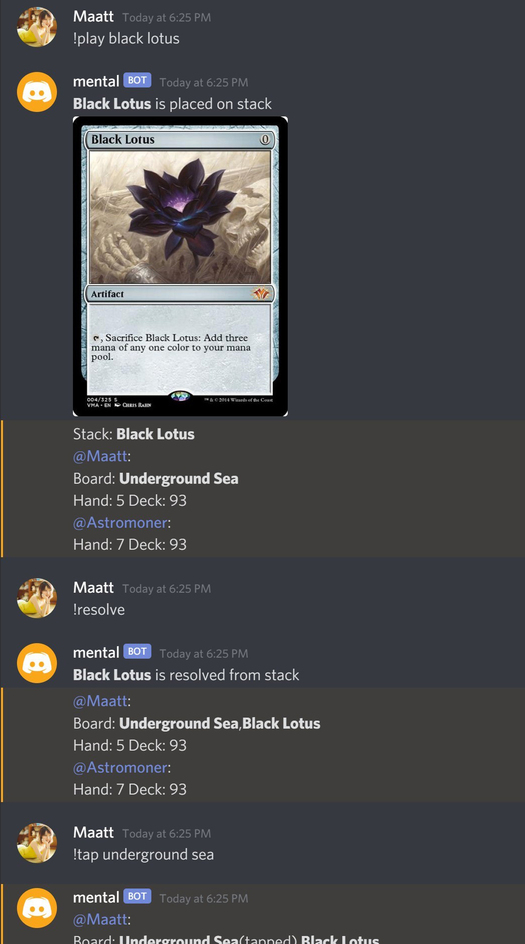
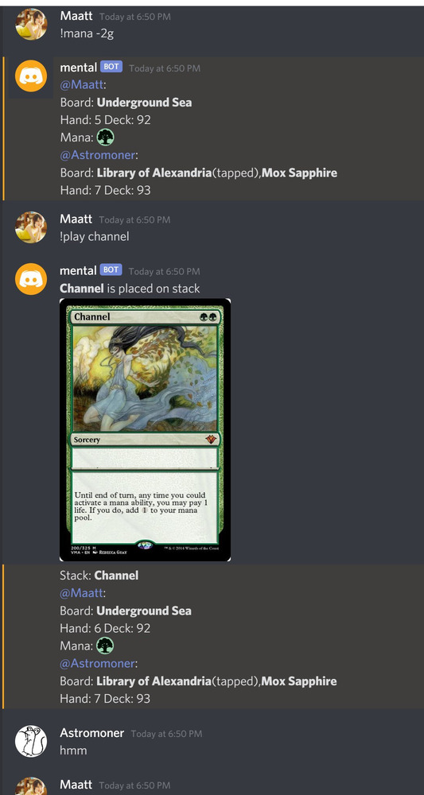
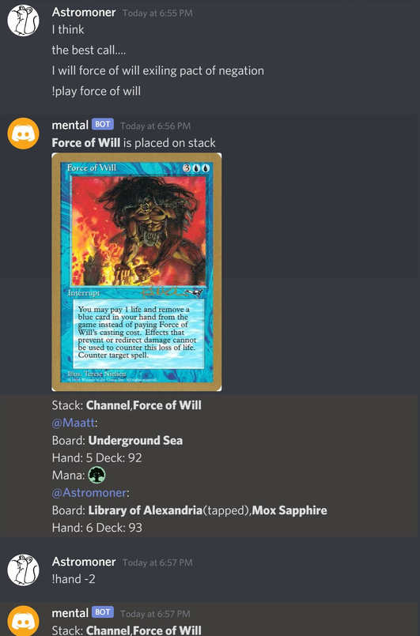

# Play Magic* On Discord





# What?

My friend and I invented a format called **Mental**, where you can
play whatever cards you want. See discussion about the full rule set [here](https://www.reddit.com/r/magicTCG/comments/j4su4a/guaranteed_turn_one_win_with_arbitrary_opening/).

This is a discord bot that allows you to play the format. Note this is simple interface for displaying game states. 
Most game mechanics isn't handled and need to be manually performed as if players were playing paper.

# Developers

- You should add `./icons/*.png` to the server emojis to have floating mana displayed correctly. Name each emoji 
with lower case letters and a trailing underscore, like :w_:, :u_:, etc.

- Download [AllPrintings.json](https://mtgjson.com/downloads/all-files/) to project root directory
 and run `$ node ./libexec/card_parser.js` to pre-compile some json files we need. Mainly card IDs, card types and names.
 Theses json files are already version controlled (`IDtoCard.json` `IDtoName.json`). You can skip this step if you don't
 want potential updated card data.

- add `config.json` to project root with "prefix" entry and your discord bot token (fake token shown here).
    
    ```json
    {
      "prefix": "!",
      "token": "Uzc0MDE4MjYxMRYyMzkzNjIw.Y6Rqrg.SCfPnHgOjIbiDeCDGlVk8XHiHJY"
    }
    ```  
- add a `game_state.json` with empty object "{}" under project root.

# Todo List

- Implement Graveyard & Exile (which hardly matters in Mental)
- In-place game state display by editing messages
 instead of showing them over and over again.
- a real backend that handles card & game mechanics?
 (There are existing open source mtg engines like xmage or opensourcerer)
